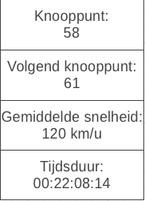

#  ANWB Fietsroutes

## Applicatie

De ontwikkelaars van deze applicatie houden ervan om in hun vrije tijd te fietsen, maar het liefst via mooie routes, routes die autoluw zijn en routes die de mooie natuurgebieden doorkruizen. ANWB heeft hier, een lange tijd geleden, een mooi idee voor ontworpen. De "ANWB Fietsroutes met knooppunten". Het volgende komt van de website van de ANWB af:

> Het idee is even simpel als briljant: de mooiste fietspaden en autoluwe wegen in een regio vormen een netwerk. Waar twee of meer paden elkaar kruisen is een knooppunt met een nummer en een informatiebord/kaart. In ons land zijn er 48 regionale fietsroutenetwerken met een gezamenlijke lengte van 32.000 kilometer!

Dit idee is door de ANWB erg goed uitgewerkt, maar het is al verouderd. Alles gebeurd, in dit digitaal tijdperk, nog offline. Om een route te maken moet de fietser een brief schrijven met daarop de knooppunten. Deze knooppunten volg je dan en zodoende heb je een fietsroute met veel fietsplezier.

>De routebeschrijving van een fietstocht is niet meer dan een briefje op je fietsstuur. De code 43-38-69-29-33-34-30-88-04-03-10-16-43 is alles wat je nodig hebt voor dertig kilometer fietsplezier rond Ootmarsum, om een voorbeeld te noemen.

Hier willen wij een oplossing voor verzinnen. Een brief aan het stuur anno 2017. Dat is niet meer van deze tijd. Hier hebben wij een oplossing voor in gedachte, namelijk:

De gebruiker van de applicatie kan een code voor een fietsroute inplannen in de applicatie, waarna de gebruiker begint met het fietsen. Op het scherm krijgt de gebruiker te zien naar welk knooppunt hij moet fietsen en krijgt hij het daaropvolgende knooppunt te zien. Als de gebruiker bijna bij het knooppunt is aangekomen dat wordt er een geluid afgespeeld, zodat de gebruiker weet dat hij het knooppunt benadert. Eenmaal aangekomen wordt het volgende knooppunt getoond en wordt het daaropvolgende knooppunt ververst. Op deze manier hoeft de gebruiker de codes van de fietsroute niet meer te onthouden. Alles wordt op het scherm weergegeven. Onderstaande afbeelding dient voor opheldering:



- Knooppunt
    - Het eerstvolgende knooppunt waar de gebruiker aankomt
    - Het knooppunt die volgt na het eerstvolgende knooppunt
    - Gemiddelde snelheid van de fietser
    - Tijdsduur van de gehele route

Voor deze applicatie 2 wordt er nog nauwelijks gebruikt van de grafische krachten van het ionic framework. Wij willen dat applicatie 2 een stabiele basis vormt voor applicatie 3, waarbij op applicatie 2 wordt verder gebouwd.

Voor meer informatie over de fietsroutes: [ANWB fietsroutes](https://www.anwb.nl/fietsen/hoe-werkt-het)

### Vereisten van de applicatie

Eis | MosCow | Voltooid
---|---|---
De gebruiker kan de code van de fietsroute invoeren. | M | x
De gebruiker kan het eerstvolgende knooppunt zien. | M | x
De gebruiker kan het daaropvolgend knooppunt zien. | M | x
De applicatie kan de GPS sensor uitlezen. | M | x
De applicatie kan het compas uitlezen. | S |
De gebruiker kan zijn gemiddelde snelheid zien. | S | x
De applicatie speelt geluid af bij benaderen van knooppunt | S | x
De gebruiker kan zijn tijdsduur zien. | S | x
Constant data ontvangen van GPS en compas, rekening houden met de performance en battery drain | S | x

### Invoer

De gebruiker voert ieder knooppunt apart in in de applicatie. Op de afbeelding hierboven staat dit niet aangegeven i.v.m. de eenvoud van het invoeren van een route. De routeinvoer wordt hetzelfde als ANWB op de website beschrijft, ditmaal alleen digitaal i.p.v. op papier. De gebruiker voort op de applicatie het volgende in op een route rondom Barneveld te volgen: 66-65-01-76-17-93-47-78-51-68-08.

Als de gebruiker volgende code invoert weet de applicatie ongeveer de route. Op het eerst wordt alleen aangegeven welke richting de gebruiker op moet fietsen om de volgende knooppunt te bereiken. 

### Moeilijkheidsgraad

De ontwikkelaars moeten nog een kleinschalig onderzoek doen naar de haalbaarheid van bovenstaande applicatie binnen de gegeven tijdsperiode van school. Bovenstaande klinkt niet direct lastig, maar de positie van de gebruiker moet bovenop een locatie van een map gelegd worden om te kijken of de gebruiker bijna bij een knooppunt is, of als de gebruiker al het knooppunt voorbij is. Als de gebruiker voorbij het knooppunt is, moet automatisch het volgende knooppunt getoond worden. Wegens onvoldoende kennis met bovenstaande systemen kan er op het moment geen moeilijkheidsgraag gegeven worden.

## Uitbreiding

Hierboven worden al elementen genoemd om deze applicatie uit te breiden. De applicatie wordt verder ontwikkeld, zodat er meerdere functionaliteiten aangeboden worden. De commit voor App2: [#6e6b3fb](https://github.com/HANICA-MAD/dha-Maurice-Rozema/commit/6e6b3fb39a8bf7b4436089070a9bb787cd03cbe2)

Alle bovenstaande functionaliteit willen wij behalen in App2, waarbij App3 een doorontwikkeling is van App2. Door deze keuze wordt App2 een solide basis voor App3. Waarbij in App2 geen, tot nauwelijks rekening wordt gehouden met de UI. De UI wordt in App3 ontwikkeld/doorwikkeld. 

Wat er in App3 ontwikkeld moet worden, tot nu toe:

Eis | MosCow | Voltooid
---|---|---
Meer inzicht geven in trainingsgegevens. | M | x
Opslaan van trainingdata op de device van de gebruiker. | M | x
Inladen van trainingsdata op de device van de gebruiker. | M | x
Code, folderstructuur en bestandsnamen voldoen aan de Angular Styleguide | M | x
App ondersteund platform specifieke code | S | x

## Installatie

Requirements om dit project te gebruiken:

### Node.JS (https://nodejs.org/download/)
#### NPM (Node Package Manager, deze komt ook met de node.js installatie)
In het geval dat je niet de laatste versie van npm hebt:
```sh
$ sudo npm install npm -g
```

#### Cordova & Ionic CLI
Om beide op je systeem te installeren, gebruik het volgende commando:
```sh
$ sudo npm install cordova ionic -g
```

### Automatisch installeren van NPM dependencies (aangeraden)
```sh
npm install
```

### Handmatig installeren van NPM depedencies

#### GPS module
```sh
npm install --save @ionic-native/geolocation
```

#### Native Audio
```sh
npm install --save @ionic-native/native-audio
```

#### Native Fingerprint
```sh
npm install --save @ionic-native/fingerprint-aio
```

#### Vibration Motor
```sh
npm install --save @ionic-native/vibration
```

#### Native Storage
```sh
npm install --save @ionic-native/native-storage
```

## Applicatie starten

Om de applicatie te starten in de browser run: `ionic serve`. Dit draait de applicatie zonder cordova, hierdoor werken sommige sensoren niet zoals gewenst. Om cordova te draaien in de applicatie type het volgende commando: `ionic cordova run browser`. Je kunt `browser` vervangen met `android` en `ios` om op het respectievelijke platform de applicatie de starten.

## Ontwikkelaars
- Wilco Bonestroo
- Maurice Rozema

## Bronnen

- [Ionic Deploy](http://ionicframework.com/docs/v1/guide/testing.html)
- [Ionic CLI](https://ionicframework.com/docs/cli/)
- [Node JS](https://nodejs.org/download/)
